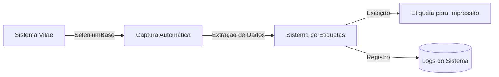
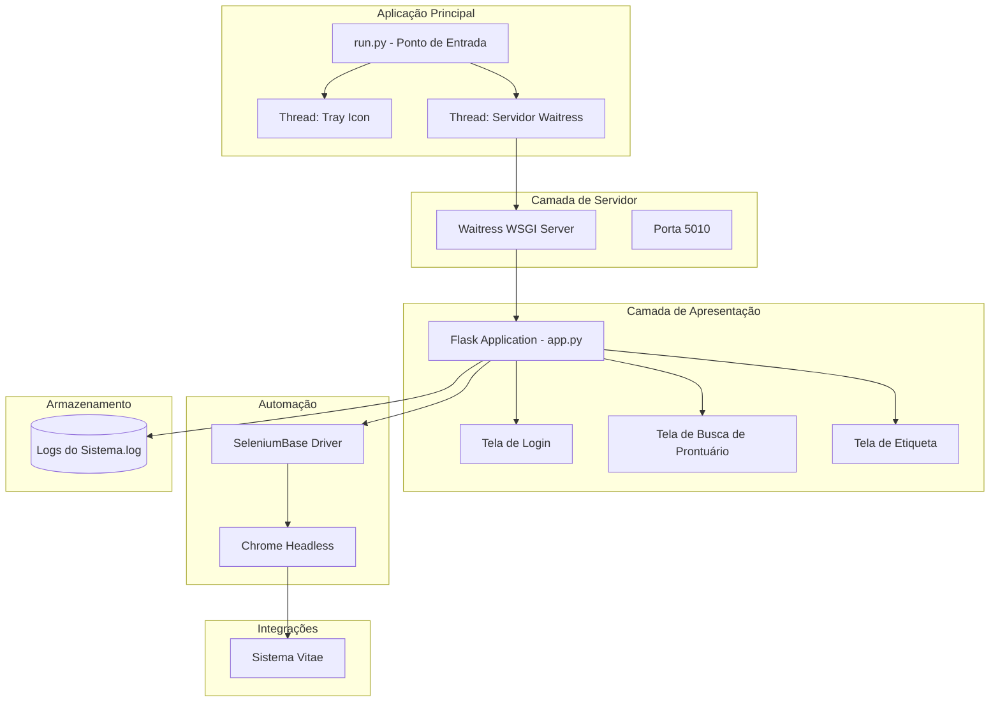
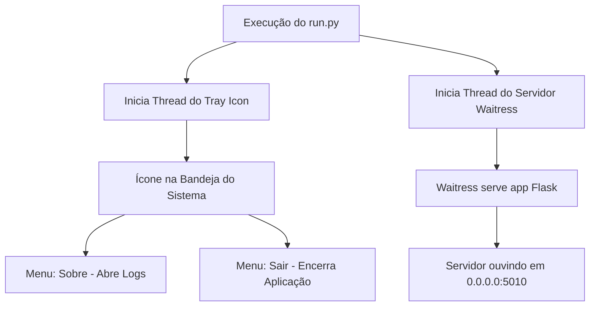
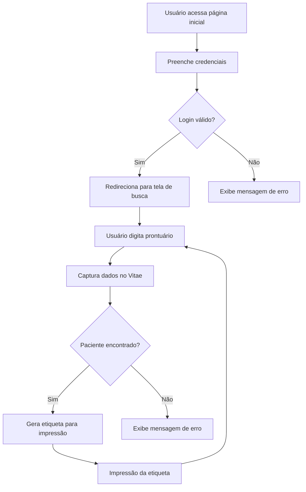

# 🩸 Sistema de Etiquetas - Agência Transfusional

[](https://semver.org)
[](LICENSE)
[]()
[](https://www.python.org/)
[](https://flask.palletsprojects.com/)
[](https://docs.pylonsproject.org/projects/waitress/en/stable/)
[](https://seleniumbase.io/)

## 📋 Sobre o Projeto

O **Sistema de Etiquetas da Agência Transfusional** é uma solução desenvolvida para otimizar o fluxo de trabalho da agência transfusional, permitindo a rápida captura e impressão de etiquetas de identificação de pacientes. O sistema se integra ao sistema hospitalar Vitae para buscar informações dos pacientes e gerar etiquetas padronizadas, reduzindo o tempo de atendimento e minimizando erros manuais.

### 🏥 Status Atual de Implantação

Sistema em produção na **Agência Transfusional do Hospital Regional Norte**, facilitando o processo de identificação de pacientes para coleta e transfusão de hemocomponentes.

## 🎯 Objetivos de Negócio

- **Agilidade no Atendimento:** Reduzir o tempo de busca e impressão de etiquetas de identificação
- **Precisão dos Dados:** Eliminar erros de digitação através da captura automática do sistema Vitae
- **Rastreabilidade:** Registrar todas as operações em logs para auditoria
- **Facilidade de Uso:** Interface simples e intuitiva para operadores da agência transfusional
- **Operação Discreta:** Aplicativo executado em background com ícone na bandeja do sistema

## 👥 Público-Alvo

- **Técnicos de Enfermagem:** Responsáveis pela coleta e identificação de pacientes
- **Farmacêuticos/Bioquímicos:** Responsáveis pela liberação de hemocomponentes
- **Coordenador da Agência Transfusional:** Gestão e auditoria do processo

## 🚀 Funcionalidades Principais

### 1. Interface de Bandeja do Sistema (System Tray)

O aplicativo roda em background com um ícone na bandeja do sistema Windows:

| Funcionalidade | Descrição |
|----------------|-----------|
| **Ícone na Bandeja** | Ícone personalizado (icone_etiquetaAT.jpg) na área de notificações |
| **Menu Contextual** | Opções disponíveis ao clicar com botão direito no ícone |
| **Sobre / Logs** | Abre uma janela de console para visualização dos logs do sistema |
| **Sair** | Encerra completamente o servidor e o aplicativo |

### 2. Sistema de Autenticação

O sistema possui autenticação para acesso seguro:

| Funcionalidade | Descrição |
|----------------|-----------|
| **Login Seguro** | Credenciais do usuário são validadas no sistema Vitae |
| **Sessão Persistente** | Mantém o usuário logado durante a utilização |
| **Logout Automático** | Encerramento seguro da sessão e do driver do navegador |

### 3. Busca de Pacientes por Prontuário

| Funcionalidade | Descrição |
|----------------|-----------|
| **Campo de Busca** | Entrada rápida do número de prontuário |
| **Validação** | Verificação se o prontuário existe no sistema Vitae |
| **Feedback Visual** | Mensagens de erro ou sucesso na busca |

### 4. Captura de Dados do Sistema Vitae


### 5. Arquitetura do Sistema

### 6. Fluxo de Inicialização do Aplicativo

### 7. Fluxo de Autenticação e Busca

### 8. Fluxo de Captura de Dados (SeleniumBase)
```mermaid
graph TD
    A[Recebe prontuário] --> B[Verifica sessão ativa]
    B --> C{Sessão ativa?}
    C -->|Não| D[Realiza login no Vitae]
    C -->|Sim| E[Fechar modais de notificação]
    D --> E
    E --> F[Navega para Assistência]
    F --> G[Seleciona opção de busca]
    G --> H[Digita prontuário]
    H --> I[Confirma busca]
    I --> J{É paciente obstétrico?}
    J -->|Sim| K[Captura dados da mãe]
    J -->|Não| L[Captura dados do paciente]
    K --> M[Extrai informações]
    L --> M
    M --> N[Retorna dados para exibição]
